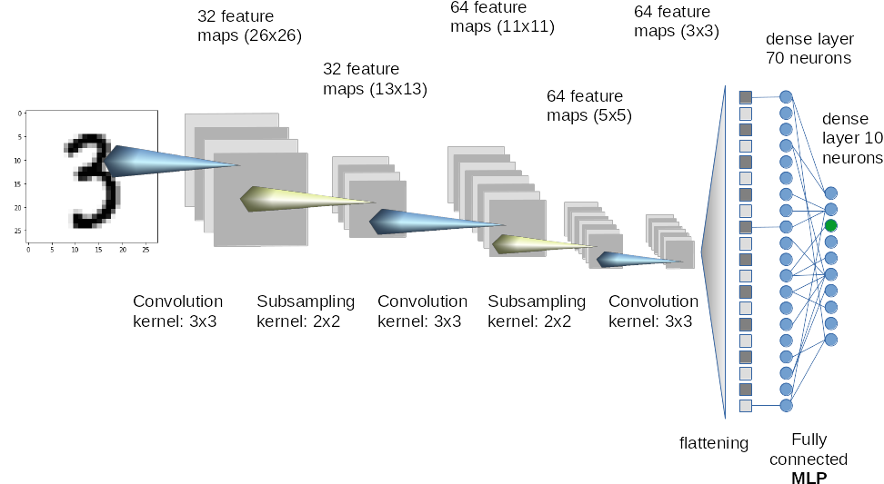

# MNIST Handwritten Digit Recognition in CUDA
In this repo, a simple convolutional neural network (CNN) is built using CUDNN / CUBLAS and trained to recognize handwritten digits using the MNIST dataset. Training a classifier on the MNIST dataset can be regarded as the hello world of image recognition.

<div class="center">

<p> MNIST dataset example </p>
</div>

<div class="center">

<p> Convolution neural network (CNN) example </p>
</div>


# How to use

```bash
$ git clone https://github.com/richardxs/MNIST_CUDA.git
$ cd MNIST_CUDA
$ bash download-mnist-dataset.sh (optional)
$ make
$ ./cnn
```

# Expected output
```
== MNIST training with CUDNN ==
[TRAIN]
loading ./dataset/train-images-idx3-ubyte
loaded 60000 items..
.. model Configuration ..
CUDA: conv1
CUDA: pool
CUDA: relu
CUDA: conv2
CUDA: dropout
CUDA: pool
CUDA: relu
CUDA: linear1
CUDA: relu
CUDA: linear2
CUDA: relu
CUDA: linear3
CUDA: softmax
conv1: Available Algorithm Count [FWD]: 10
conv1: Available Algorithm Count [BWD-filter]: 9
conv1: Available Algorithm Count [BWD-data]: 8
.. initialized conv1 layer ..
conv2: Available Algorithm Count [FWD]: 10
conv2: Available Algorithm Count [BWD-filter]: 9
conv2: Available Algorithm Count [BWD-data]: 8
.. initialized conv2 layer ..
.. initialized linear1 layer ..
.. initialized linear2 layer ..
.. initialized linear3 layer ..
step:  200, accuracy: 75.3418%
step:  400, accuracy: 92.7012%
step:  600, accuracy: 95.0547%
step:  800, accuracy: 96.2168%
step: 1000, accuracy: 96.9238%
step: 1200, accuracy: 97.2285%
step: 1400, accuracy: 97.584%
step: 1600, accuracy: 97.8867%
step: 1800, accuracy: 98.0977%
step: 2000, accuracy: 98.1562%
step: 2200, accuracy: 98.293%
step: 2400, accuracy: 98.3828%

[INFERENCE]
loading ./dataset/t10k-images-idx3-ubyte
loaded 10000 items..
conv1: Available Algorithm Count [FWD]: 10
conv1: Available Algorithm Count [BWD-filter]: 9
conv1: Available Algorithm Count [BWD-data]: 8
conv2: Available Algorithm Count [FWD]: 10
conv2: Available Algorithm Count [BWD-filter]: 9
conv2: Available Algorithm Count [BWD-data]: 8
accuracy: 97.95%
Done.

```

# Reference
> [MNIST handwritten Digit Recognition in Pytorch](https://nextjournal.com/gkoehler/pytorch-mnist)
> [mnist cudnn](https://github.com/haanjack/mnist-cudnn)
> [mnist data](https://yann.lecun.com/exdb/mnist/index.html)
